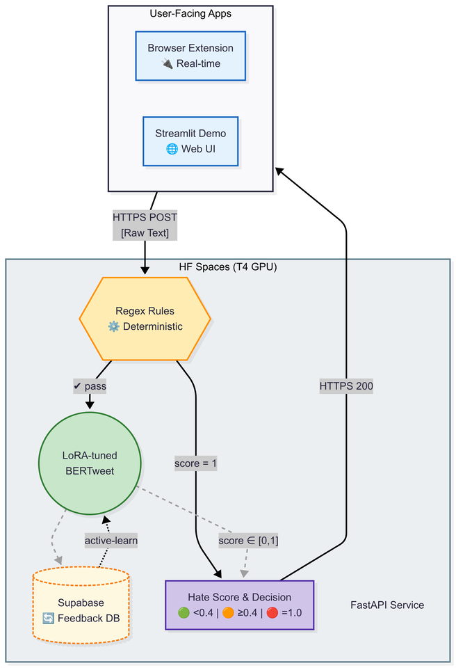
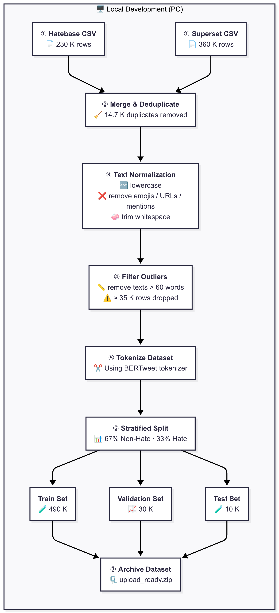
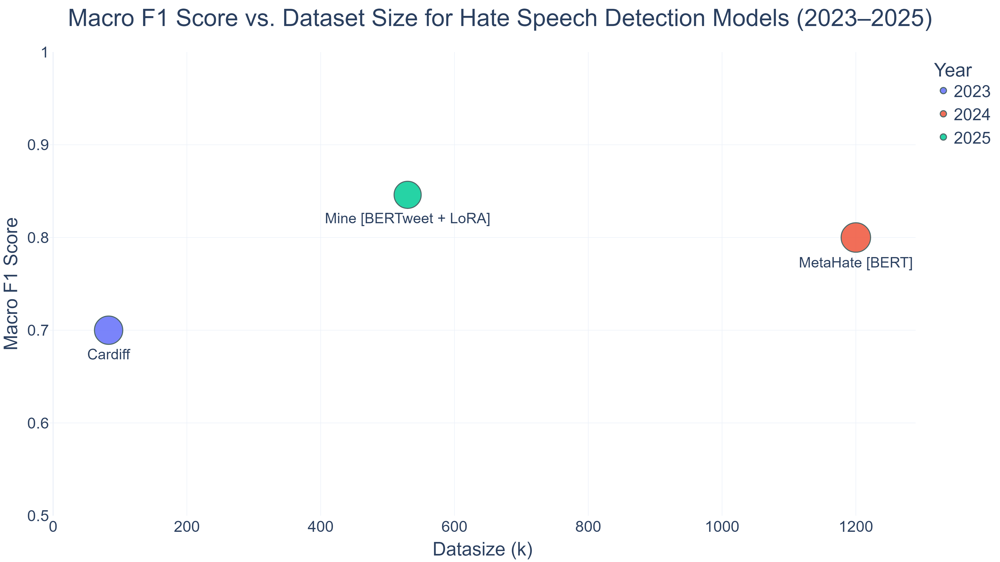
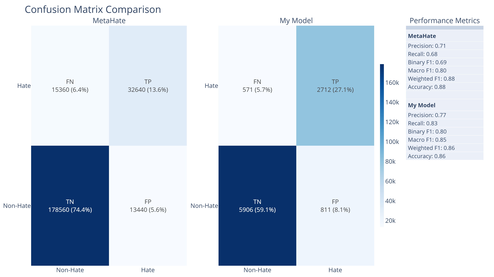
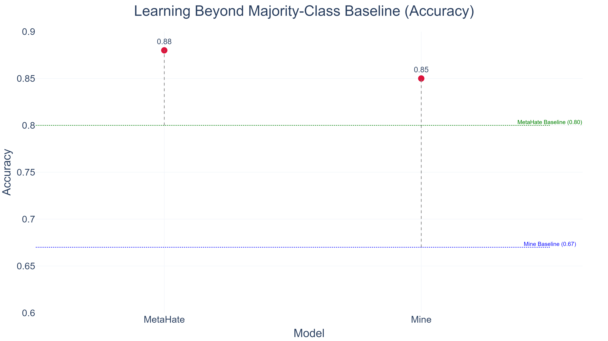
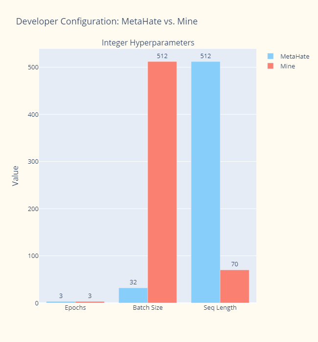

# AI-Powered Textual Hate Content Moderation

[](https://hate-speech-detection-app.streamlit.app/)
[](https://wandb.ai/medoxz543-zewail-city-of-science-and-technology/Textual%20Hate%20Content%20Moderation%20with%20BERTweet%20%2B%20LoRA?nw=nwusermedoxz543)
[](https://huggingface.co/medoxz543/hate-speech)
[](https://huggingface.co/spaces/medoxz543/hate-endpoint)
[](https://huggingface.co/datasets/Machlovi/Hatebase)
[](https://huggingface.co/datasets/manueltonneau/english-hate-speech-superset)
[](https://mermaid.js.org/)
[](https://opensource.org/licenses/Apache-2.0)

## 🚀 TL;DR

**A multi-layer moderation pipeline (regex ⚡ + LoRA-tuned BERTweet 🧠) for real-time hate speech detection.**  
⚙️ Inference: **< 1s** (GPU) · **2–10s** (CPU)  
📦 Deploys as a Hugging Face Space  
🧩 Powers a browser extension & Streamlit demo  
🔁 Continuously improves via Supabase user feedback

---

## 🛑 The Problem

- **Hate travels at Wi-Fi speed.** The meteoric rise in internet use has **amplified** toxic content everywhere.  
- **Human moderation doesn’t scale.** Platforms long relied on armies of contractors—great for coverage, brutal for **mental health**.  
- **Well-being crisis.** Studies link prolonged exposure to graphic content with PTSD-like symptoms.  
- **Automation to the rescue… sort of.** Big platforms use ML filters, but keep them locked behind **pricey**, **opaque** APIs.  
- **Our twist:** Deliver that moderation power **directly to end-users**.  

---

## 🏗️ System Architecture


---

## 📊 Data Pipeline


---

## 🧠 Model-Training Recipe

| Component                | Setting / Value |
|--------------------------|-----------------|
| **Base model**           | `BERTweet-base` (pre-trained on 850 M tweets) |
| **Fine-tuning strategy** | **LoRA** (rank = 16, α = 12, dropout = 0.1)<br/>Target modules: `query`, `key`, `value`, `attention.output.dense` |
| **Trainable parameters** | **1.87 M** / 136.6 M &nbsp;*(≈ 1.37 %)* |
| **Batching**             | Train = 512 · Eval = 256 · Grad accum = 2 |
| **Precision tricks**     | FP16 + Gradient Checkpointing |
| **Optimizer**            | `adamw_torch_fused`<br/>LR = 2 e-3 · Cosine decay · Weight decay = 0.01 · Max grad norm = 1.0 · Warm-up ratio = 10 % |
| **Epochs**               | 3 |
| **Wall-clock time**      | **< 2 h** on single T4 GPU (Kaggle) |


<details>
<summary>💡 Why these choices?</summary>

- **LoRA @ 1.37 % trainable params** slashes VRAM & speeds training with almost no accuracy loss.  
- **High batch size (512)** keeps GPU 100 % utilised; gradient accumulation = 2 fits into 16 GiB.  
- **FP16 + Grad Checkpointing** halves memory overhead and allows deeper unrolled computations.  
</details>

**Experiment tracking & sweeps**

- 📊 **Every single run**—from quick sanity checks to final fine-tune—was logged to **Weights & Biases** for metrics, artefacts, and reproducibility.  
- 🔍 **4 W&B hyper-parameter sweeps** explored batch size, learning rate, and LoRA ranks/α values.  
  - Selection metric: **MCC** on the validation set.  
  - Best sweep config (the table above) was then fine-tuned for 3 full epochs.  
- 🎯 Final model, artefacts, and dashboards live here → see the W&B badge at the top of the README.

## 📈 Performance Comparison

| Model / Paper (Year) | Accuracy | **Macro&nbsp;F1** | MCC | Trainable Params | Train Data (k) | Batch Size |
|----------------------|:-------:|:-------------:|:---:|:----------------:|:--------------:|:-------------:|
| **Ours** (BERTweet + LoRA, 2025) | **0.86** | **0.85** | 0.68 | **1.87 M** (≈ 1.37 %) | **530** | 512 |
| MetaHate (BERT-base, 2024) | 0.88 | 0.80 | – | 110 M (full fine-tune) | 1,200 | 12-32 |
| Cardiff (BERTweet + Finetuning, 2023) | 0.70 | 0.70 | – | Not mentioned | 100 | 12-32 |

<sub>*All experiments tracked in **Weights & Biases**; full dashboards linked via the badge above.*</sub>

### 🔍 Key take-aways
1. **LoRA efficiency** – we update only **1.87 M / 136.6 M** parameters (≈ **×78 fewer** than vanilla fine-tune) yet stay within **3 pp** of MetaHate’s accuracy.  
2. **Data leverage** – with **~½ the training data** of MetaHate we still nudge past it on **Macro F1 (0.85 vs 0.80)**.  
3. **Hardware friendly** – a single free Kaggle **T4** (< 2 h).

<details>
<summary>📊 Show Comparison Plots</summary>









</details>

---

### 🔄 Active-Learning Loop (MVP status)

| Phase | What Happens **today** | Why It Matters |
|-------|------------------------|----------------|
| **1️⃣ User Feedback** | In the **Streamlit UI**, users hit **“Disagree”** when the model over-flags. | Captures hard cases (sarcasm, denialism). |
| **2️⃣ Real-time Log** | Streamlit writes `{text, model_score, user_label}` straight into **Supabase (PostgreSQL)**. | Durable, queryable store. |
| **3️⃣ Manual Export** | 🔧 **Current**: I run a short Python script (`scripts/export_feedback.py`) to pull fresh rows.<br/>🛠 **Planned**: GitHub-Actions cron (`Sun 02:00 UTC`). | Transparency—no hidden automation yet. |
| **4️⃣ LoRA-only Fine-Tune** | Resume training on the feedback slice for 3 epochs (LoRA adapters only). | Cheap, avoids catastrophic forgetting. |
| **5️⃣ Manual Deploy** | Evaluate → upload weights to the HF Space via CLI if Macro-F1 holds. | Safety gate until CI is in place. |

---

## 🛠️ How to Run Locally
```bash
# Clone repo
git clone https://github.com/yourusername/hate-moderation-system.git
cd hate-moderation-system

# Create environment
conda env create -f environment.yml
conda activate hate-moderation

# Start API (localhost:8000)
uvicorn app.main:api --reload

# Launch Streamlit UI (localhost:8501)
streamlit run app/streamlit_app.py
```
---

### 🛣️ Future Upgrades

| Roadmap Item                                     | Rationale                                                                                                                                                 |
| ------------------------------------------------ | --------------------------------------------------------------------------------------------------------------------------------------------------------- |
| **CI-Driven Retraining** (GitHub Actions + cron) | Remove manual steps, guarantee weekly model refresh.                                                                                                      |
| **Decoder Architecture** (e.g., Flan-T5)         | Tackle ambiguous hate from a **prompting† perspective** (classification via instruction tuning).                                                          |
| **Feedback RL** (DPO / RLHF)                     | Train with **direct preference optimisation** instead of plain supervised fine-tune, giving better control over false-positive/false-negative trade-offs. |

<sub> Prompt-based decoder models can integrate user feedback instructions (“This tweet is not hateful because…”) far more naturally than encoder-only BERTweet.</sub>

---

## 📜 License
Apache 2.0 - Free for research and commercial use with attribution.  
**Contribution guideline**: Hate speech detection ≠ hate speech generation.